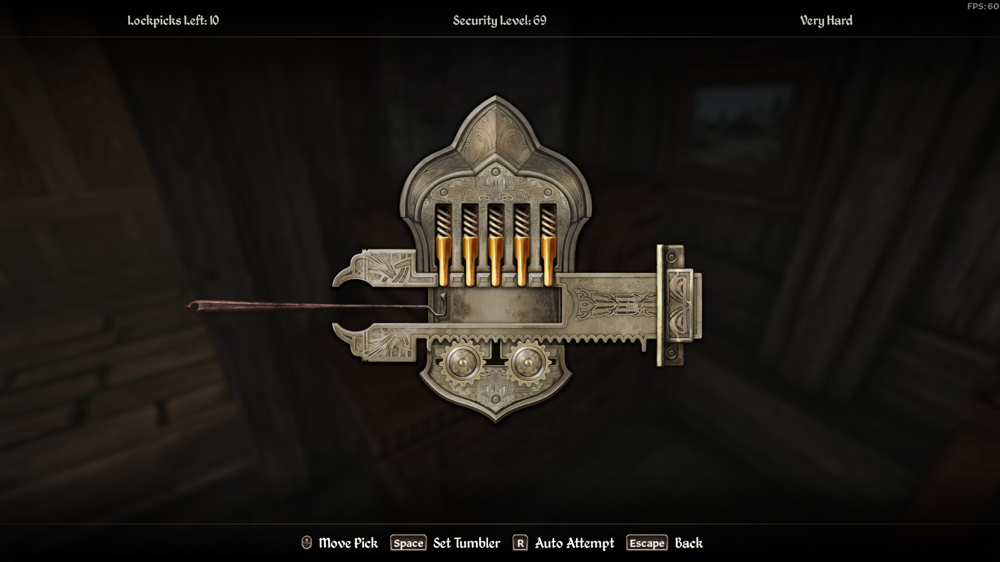
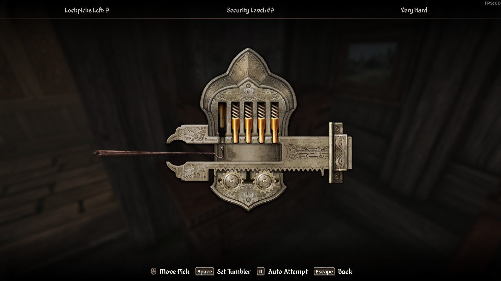
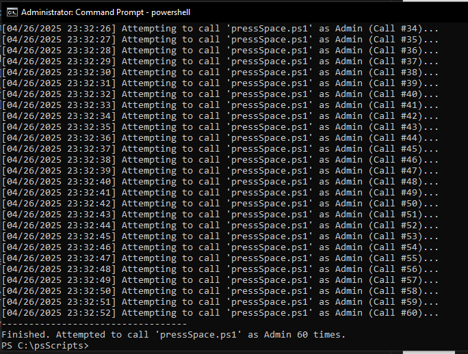
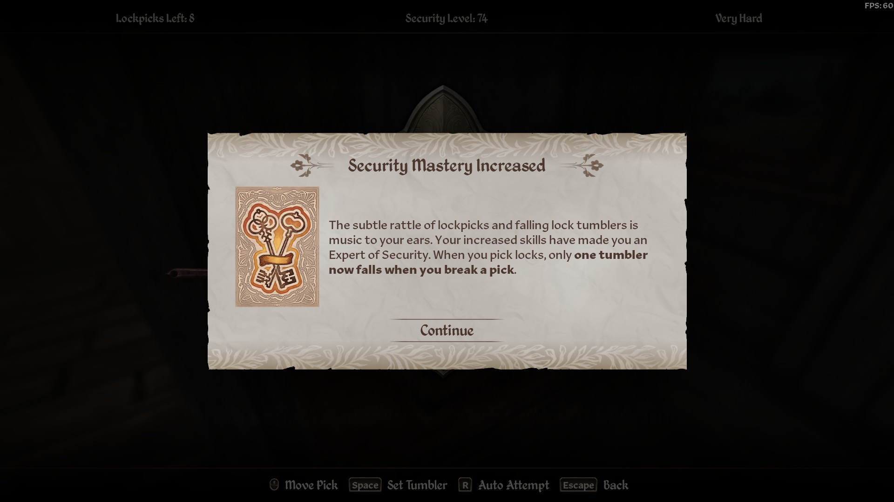

# How to level lockpicking in Oblivion remastered 

## The Glitch 
I stumbled upon an exploit exists in Oblivion remastered where rapidly sending 'activate' inputs (spacebar) after successfully setting the *first* tumbler grants repeated lockpicking XP. It was fun to spam for two minutes before I knew there had to be a better way.

## The Problem: Window Focus Instability

An initial attempt involved a simple PowerShell script (`pressSpace.ps1`) running with administrator privileges to send a large number of `[System.Windows.Forms.SendKeys]` commands (e.g., 1000) to the game window.

**Observation:** Despite running as admin (solving potential UAC/permission issues), only the first ~5-20 `SendKeys` commands registered in-game.

**Root Cause: Window Focus Loss**

The primary reason for failure is the inherent instability of window focus in Windows:

* `SendKeys` directs input *only* to the currently active foreground window.
* Window activation commands (like `AppActivate`) run only once at the start. They cannot guarantee sustained focus.
* During a long `SendKeys` loop, numerous system events (notifications, background tasks, game state changes) can cause another window to steal focus.
* Once focus is lost, all subsequent `SendKeys` commands are misdirected, rendering the rest of the loop ineffective for the target game. Administrator privileges do not prevent this focus-stealing behavior.

**Some quick reads I found on this**

* [Stack Overflow: Powershell SendKeys No Input](https://stackoverflow.com/questions/69138816/powershell-sendkeys-no-input) (Discusses SendKeys fragility)
* [VBForums: Problem to sendkeys with focus](https://www.vbforums.com/showthread.php?391255-Resolved-Problem-to-sendkeys-with-focus) (Highlights focus dependency)
* [Reddit: How do I keep a window in focus or direct keystrokes](https://www.reddit.com/r/PowerShell/comments/yrukie/how_do_i_keep_a_window_in_focus_or_direct/) (Discusses `AppActivate` limitations and focus challenges)

## The Wrapper Script Solution

To overcome the focus limitation, a second script (`callPressSpace.ps1`) acts as a launcher:

1.  It repeatedly executes the original `pressSpace.ps1` script at short intervals (e.g., every 1 second).
2.  It uses `Start-Process powershell.exe -Verb RunAs` to launch *each* instance of `pressSpace.ps1` with administrator privileges.

**Why this is More Effective:**

* **Admin Rights:** Ensures `pressSpace.ps1` has the necessary permissions to interact with the game window (overcoming UAC/integrity level blocks).
* **Focus Mitigation:** Executing in *short, repeated bursts* (e.g., 20 clicks per second) drastically reduces the impact of focus loss. Each new instance gets a fresh chance to target the (hopefully) active game window immediately after launch. While focus might still be lost *during* a burst, the frequent restarts make it highly probable that many bursts will execute successfully before focus shifts, providing much greater reliability than one long, vulnerable execution.

##  Setup

1) Find a lock to pick

2) Pick the first tumblr

3) Run `callPressSpace.ps1` as an admin.

4) Profit 

- Note: Ensure you sleep every once in a while to claim the levels from leveling lockpicking. 
